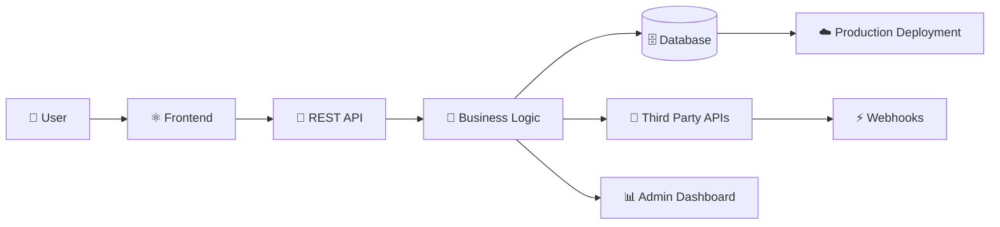

<div align="center">


<br/>


<br/><br/>

<p>
<a href="https://www.linkedin.com/in/dheeraj-kumar-87382b222/">

</a>

<a href="mailto:dheerajk92114@gmail.com">

</a>

<a href="https://github.com/dheerajcoding">

</a>
</p>

```text
╔══════════════════════════════════════════════════════════════════════╗
║                                                                      ║
║                 SOFTWARE IS A SYSTEM, NOT JUST CODE.                ║
║                                                                      ║
║   USERS → INTERFACES → APIs → BUSINESS LOGIC → DATA → AUTOMATION    ║
║                                                                      ║
╚══════════════════════════════════════════════════════════════════════╝
```

</div>

---

# `$ whoami`

```typescript
const dheeraj = {
  name: "Dheeraj Kumar",

  role: "Full-Stack Developer",

  focus: [
    "Production Web Applications",
    "REST APIs",
    "Webhook Integrations",
    "Business Workflow Systems",
    "CRM & Lead Management",
    "Third-Party API Integrations",
    "AI-Powered Automation"
  ],

  stack: {
    frontend: [
      "React",
      "Next.js",
      "JavaScript",
      "TypeScript",
      "Tailwind CSS"
    ],

    backend: [
      "Node.js",
      "Express.js",
      "REST APIs",
      "Authentication",
      "Webhooks"
    ],

    databases: [
      "MongoDB",
      "MySQL",
      "PostgreSQL"
    ],

    infrastructure: [
      "Docker",
      "Linux",
      "Nginx",
      "Git"
    ]
  },

  currentMission:
    "Develop deep engineering fundamentals while building practical production-oriented systems."
};
```

---

# 👨‍💻 ABOUT ME

I am a **Full-Stack Developer** focused on understanding how complete software systems work in the real world.

I enjoy working across the complete application lifecycle:

```text
┌──────────────┐
│    USERS     │
└──────┬───────┘
       │
       ▼
┌──────────────┐
│   FRONTEND   │
└──────┬───────┘
       │
       ▼
┌──────────────┐
│   REST API   │
└──────┬───────┘
       │
       ▼
┌──────────────┐
│ BUSINESS     │
│ LOGIC        │
└──────┬───────┘
       │
       ├──────────────► THIRD-PARTY APIs
       │
       ├──────────────► WEBHOOKS
       │
       ▼
┌──────────────┐
│   DATABASE   │
└──────┬───────┘
       │
       ▼
┌──────────────┐
│ PRODUCTION   │
└──────────────┘
```

My interests include:

* 🏗️ Full-stack applications
* 🔌 Backend APIs
* 🔗 Webhooks and integrations
* 📊 CRM and lead-management systems
* ⚙️ Business workflow automation
* 🤖 AI-powered application workflows
* ☁️ Deployment and production maintenance

---
# ⚡ ENGINEERING FOCUS

<div align="center">




# ⚡ ENGINEERING PHILOSOPHY

```text
UNDERSTAND THE PROBLEM
          │
          ▼
MAP THE WORKFLOW
          │
          ▼
DESIGN THE SYSTEM
          │
          ▼
BUILD THE FEATURES
          │
          ▼
CONNECT THE SERVICES
          │
          ▼
TEST THE DATA FLOW
          │
          ▼
DEPLOY & IMPROVE
```

> **My goal is not simply to use more technologies. My goal is to understand systems deeply enough to design, debug and improve them independently.**

---

# 🧰 TECHNOLOGY STACK

## ⚛️ FRONTEND

<p align="center">


</p>

<div align="center">

`React` • `Next.js` • `JavaScript` • `TypeScript` • `HTML` • `CSS` • `Tailwind CSS`

</div>

---

## ⚡ BACKEND & APIs

<p align="center">


</p>

<div align="center">

`Node.js` • `Express.js` • `REST APIs` • `JWT` • `Authentication` • `Webhooks` • `API Integrations`

</div>

---

## 🗄️ DATA

<p align="center">


</p>

<div align="center">

`MongoDB` • `MySQL` • `PostgreSQL`

</div>

---

## ⚙️ DEVOPS & DEVELOPMENT

<p align="center">


</p>

<div align="center">

`Docker` • `Linux` • `Nginx` • `Git` • `GitHub` • `Postman` • `Deployment`

</div>

---

# 🏗️ FEATURED PROJECTS

---

# 01

# 💰 MYCASHBRIDGE

### `FINANCIAL PRODUCT DISCOVERY & LOAN APPLICATION PLATFORM`

🔗 **Live Platform:** https://mycashbridge.com

MyCashBridge is a financial-services platform focused on helping users explore and apply for financial products through a guided digital workflow.

The platform includes multiple financial-product journeys, eligibility flows, EMI calculation, loan discovery, lead capture and customer callback workflows.

```text
                        ┌───────────────┐
                        │     USER      │
                        └───────┬───────┘
                                │
                                ▼
                     ┌────────────────────┐
                     │ FINANCIAL PRODUCT  │
                     │ DISCOVERY          │
                     └─────────┬──────────┘
                               │
             ┌─────────────────┼──────────────────┐
             ▼                 ▼                  ▼
        PERSONAL LOAN      BUSINESS LOAN      HOME LOAN
             │                 │                  │
             └─────────────────┼──────────────────┘
                               │
                               ▼
                    ┌─────────────────────┐
                    │ ELIGIBILITY / EMI   │
                    │ CALCULATION         │
                    └──────────┬──────────┘
                               │
                               ▼
                    ┌─────────────────────┐
                    │ APPLICATION / LEAD  │
                    │ CAPTURE             │
                    └──────────┬──────────┘
                               │
                               ▼
                    ┌─────────────────────┐
                    │ BUSINESS WORKFLOW   │
                    │ & FOLLOW-UP         │
                    └─────────────────────┘
```

### PLATFORM WORKFLOWS

#### 🔍 Loan Discovery

Users can explore financial products including:

* Personal Loans
* Business Loans
* Home Loans
* Gold Loans
* Car Loans
* Education Loans
* Loan Against Property

The experience guides users from product discovery toward eligibility and application workflows.

---

### 📊 Eligibility Workflow

```text
USER DETAILS
     │
     ▼
PERSONAL INFORMATION
     │
     ▼
EMPLOYMENT / INCOME
     │
     ▼
LOAN REQUIREMENT
     │
     ▼
OUTSTANDING DEBT
     │
     ▼
CREDIT PROFILE INPUT
     │
     ▼
ELIGIBILITY / APPLICATION FLOW
```

The platform collects information such as:

* Name
* Mobile number
* City
* Employment type
* Income information
* Age
* Loan requirements
* Existing debt
* Approximate credit profile information

The workflow is designed to make the application process easier before a customer proceeds with a lending partner.

---

### 🧮 EMI & Financial Planning

```text
LOAN AMOUNT
     │
     ▼
INTEREST RATE
     │
     ▼
TENURE
     │
     ▼
CALCULATION ENGINE
     │
     ├────────► MONTHLY EMI
     │
     └────────► TOTAL PAYABLE
```

The platform provides financial planning tools that allow users to understand estimated repayment information before continuing their application journey.

---

### 📞 LEAD & CALLBACK WORKFLOW

```text
CUSTOMER
   │
   ▼
APPLICATION FORM
   │
   ▼
VALIDATION
   │
   ▼
LEAD CREATION
   │
   ▼
BUSINESS / SALES WORKFLOW
   │
   ▼
EXPERT FOLLOW-UP
   │
   ▼
APPLICATION PROGRESSION
```

This type of workflow connects the customer-facing website with internal business processes and follow-up operations.

---

### 🔐 IMPORTANT SYSTEM THINKING

Financial applications require careful handling of:

* User information
* Consent
* Data validation
* Application workflows
* Third-party partner processes
* Privacy considerations

MyCashBridge publicly positions itself as a Lending Service Provider facilitating applications rather than acting as the lender itself.

---

### PROJECT ENGINEERING VALUE

This project represents the type of system I am interested in building:

```text
FINANCIAL WORKFLOW
        +
USER EXPERIENCE
        +
DATA COLLECTION
        +
BUSINESS PROCESS
        +
LEAD MANAGEMENT
        +
SYSTEM INTEGRATION
```

---

# 02

# 📊 LEAD MANAGEMENT & BUSINESS WORKFLOW SYSTEM

### `CRM • LEAD INGESTION • WEBHOOKS • BUSINESS AUTOMATION`

🔗 **Live System:** https://olivialms.cloud

A business-oriented system designed around managing leads, workflows and operational processes.

### SYSTEM FLOW

```text
EXTERNAL SOURCE
      │
      ▼
┌───────────────┐
│ WEBHOOK / API │
└───────┬───────┘
        │
        ▼
┌───────────────┐
│ AUTHENTICATION│
│ & VALIDATION  │
└───────┬───────┘
        │
        ▼
┌───────────────┐
│ BACKEND LOGIC │
└───────┬───────┘
        │
        ▼
┌───────────────┐
│   DATABASE    │
└───────┬───────┘
        │
        ▼
┌───────────────┐
│ LEAD WORKFLOW │
└───────┬───────┘
        │
        ▼
┌───────────────┐
│ ADMIN / USERS │
└───────────────┘
```

### AREAS INVOLVED

* Lead ingestion
* Webhook workflows
* REST APIs
* API authentication
* Request validation
* Data processing
* CRM workflows
* Admin dashboards
* Business automation
* Production deployment and maintenance

---

# 03

# 🤖 AI VOICE AGENT FOR DEBT SETTLEMENT

### `AI AUTOMATION PROJECT • VOICE CONVERSATIONS • CRM INTEGRATION`

> **Industry-style AI project concept focused on building an automated voice workflow for debt-settlement programs.**

The objective is to build an AI voice agent that can interact with potential customers, understand their financial situation at a high level, collect relevant information, answer approved program questions, and transfer qualified conversations into a human-assisted workflow.

The system should **not provide unapproved financial or legal advice** and should escalate sensitive or complex cases to qualified human representatives.

---

## SYSTEM ARCHITECTURE

```text
                    CUSTOMER PHONE
                          │
                          ▼
                 ┌────────────────┐
                 │ VOICE PROVIDER │
                 └───────┬────────┘
                         │
                         ▼
                 ┌────────────────┐
                 │ SPEECH TO TEXT │
                 └───────┬────────┘
                         │
                         ▼
              ┌──────────────────────┐
              │ AI CONVERSATION      │
              │ ORCHESTRATION        │
              └──────────┬───────────┘
                         │
          ┌──────────────┼──────────────┐
          ▼              ▼              ▼
     INTENT          KNOWLEDGE       SAFETY /
     DETECTION       RETRIEVAL       COMPLIANCE
          │              │              │
          └──────────────┼──────────────┘
                         │
                         ▼
              ┌──────────────────────┐
              │ WORKFLOW ENGINE      │
              └──────────┬───────────┘
                         │
                         ▼
                  CRM / BACKEND
                         │
          ┌──────────────┼──────────────┐
          ▼              ▼              ▼
      LEAD UPDATE     HUMAN HANDOFF    FOLLOW-UP
```

---

## CORE VOICE BOT WORKFLOW

```text
INCOMING / OUTBOUND CALL
           │
           ▼
CUSTOMER CONSENT / DISCLOSURE
           │
           ▼
IDENTIFY CUSTOMER INTENT
           │
           ▼
UNDERSTAND HIGH-LEVEL
FINANCIAL SITUATION
           │
           ▼
COLLECT PROGRAM-RELEVANT
INFORMATION
           │
           ▼
ANSWER APPROVED FAQS
           │
           ▼
QUALIFICATION RULES
           │
      ┌────┴─────┐
      ▼          ▼
 QUALIFIED    NOT READY
      │          │
      ▼          ▼
 HUMAN       FOLLOW-UP /
 HANDOFF     EXIT FLOW
```

---

## EXAMPLE INFORMATION COLLECTION

The AI agent could collect information such as:

* Customer name
* Preferred contact details
* Type of debt
* Approximate outstanding debt
* Number of active accounts
* General payment difficulty
* Preferred callback time

Sensitive data collection must follow applicable privacy, consent and security requirements.

---

## AI CAPABILITIES

```text
VOICE INPUT
    │
    ▼
SPEECH RECOGNITION
    │
    ▼
INTENT DETECTION
    │
    ├──────────────► FAQ ANSWER
    │
    ├──────────────► INFORMATION COLLECTION
    │
    ├──────────────► QUALIFICATION
    │
    ├──────────────► HUMAN HANDOFF
    │
    └──────────────► FOLLOW-UP
```

Potential technical components:

* Voice provider integration
* Speech-to-text
* Large Language Model integration
* Retrieval-Augmented Generation for approved knowledge
* Backend workflow orchestration
* CRM integration
* Conversation logging
* Human handoff
* Follow-up automation

---

## CRM INTEGRATION FLOW

```text
AI VOICE AGENT
       │
       ▼
CONVERSATION EVENT
       │
       ▼
BACKEND API
       │
       ▼
DATA VALIDATION
       │
       ▼
LEAD / CONTACT UPDATE
       │
       ▼
CRM WORKFLOW
       │
       ├──────────────► SALES TEAM
       │
       ├──────────────► SETTLEMENT SPECIALIST
       │
       └──────────────► AUTOMATED FOLLOW-UP
```

---

## WHY THIS PROJECT INTERESTS ME

This project combines multiple areas of modern software engineering:

```text
AI
+
VOICE TECHNOLOGY
+
BACKEND APIs
+
WORKFLOW AUTOMATION
+
CRM INTEGRATION
+
REAL-TIME EVENTS
+
DATA MANAGEMENT
```

It represents the type of AI-powered business systems I want to continue exploring and building.

---

# 🏢 OTHER PRODUCTION-ORIENTED WORK

### Selected live platforms

| Platform                                          | Category                                   |
| ------------------------------------------------- | ------------------------------------------ |
| [RG Debt Relief](https://rgdebtrelief.com)        | Financial Services                         |
| [Reddington Global](https://reddingtonglobal.com) | Corporate / Business Platform              |
| [RG Care](https://rgcare.in)                      | Organization / Digital Platform            |
| [MyCashBridge](https://mycashbridge.com)          | Financial Product Discovery & Applications |
| [Olivia LMS](https://olivialms.cloud)             | Lead Management & Business Workflow System |

> Project responsibilities and implementation scope vary by project. This profile highlights the workflows and technologies I have worked with rather than claiming sole ownership of every part of every platform.

---

# 🔌 WHAT I ENJOY BUILDING

<table>
<tr>

<td width="50%" valign="top">

## APIs & Integrations

```text
APPLICATION
     │
     ▼
REST API
     │
     ▼
VALIDATION
     │
     ▼
BUSINESS LOGIC
     │
     ├────────► THIRD-PARTY API
     │
     ▼
DATABASE
```

* REST APIs
* Webhooks
* API Authentication
* Third-party integrations
* Data transformation
* Error handling

</td>

<td width="50%" valign="top">

## Business Workflows

```text
USER ACTION
     │
     ▼
APPLICATION
     │
     ▼
WORKFLOW
     │
     ▼
AUTOMATION
     │
     ▼
DATA
     │
     ▼
BUSINESS OUTCOME
```

* CRM Systems
* Lead Management
* LMS Platforms
* Admin Panels
* Workflow Automation
* AI Automation

</td>

</tr>
</table>

---

# 📈 GITHUB ANALYTICS

<div align="center">


<br/><br/>


</div>

---

# 🧠 CURRENT ENGINEERING ROADMAP

```yaml
CURRENT_FOCUS:

  JavaScript:
    - Deep fundamentals
    - Async programming
    - Event loop
    - Closures
    - Memory and execution

  Problem_Solving:
    - Data Structures
    - Algorithms
    - Coding patterns

  Backend:
    - API design
    - Authentication
    - Database design
    - Architecture
    - Debugging

  AI:
    - LLM integrations
    - AI workflows
    - Voice agents
    - RAG systems
    - AI automation

NEXT:

  Java:
    - Core Java
    - OOP
    - Collections

  Spring_Boot:
    - REST APIs
    - Spring Data
    - Spring Security

LONG_TERM:

  - System Design
  - Scalable Backend Systems
  - AI-Powered Applications
  - Cloud Infrastructure
  - Distributed Systems
```

---

# ⚙️ CURRENT MISSION

```text
┌──────────────────────────────────────────────┐
│                                              │
│     MISSION: BECOME A STRONG SOFTWARE        │
│              ENGINEER                       │
│                                              │
│     STATUS: ACTIVE 🟢                        │
│                                              │
└──────────────────────────────────────────────┘


JAVASCRIPT FUNDAMENTALS

████████████░░░░░░░░


FULL-STACK ENGINEERING

██████████░░░░░░░░░░


BACKEND ARCHITECTURE

████████░░░░░░░░░░░░


DATA STRUCTURES & ALGORITHMS

██████░░░░░░░░░░░░░░


AI SYSTEMS & AUTOMATION

███████░░░░░░░░░░░░░


JAVA & SPRING BOOT

█████░░░░░░░░░░░░░░


SYSTEM DESIGN

████░░░░░░░░░░░░░░░░
```

---

# 🤝 OPEN TO

```text
FULL-STACK DEVELOPMENT
          +
BACKEND ENGINEERING
          +
API & INTEGRATION WORK
          +
AI-POWERED APPLICATIONS
          +
BUSINESS SYSTEM DEVELOPMENT
          +
SOFTWARE ENGINEERING OPPORTUNITIES
```

I am particularly interested in opportunities where I can work on real systems, solve meaningful engineering problems and learn from strong software engineering teams.

---

# 📬 LET'S CONNECT

<div align="center">

<a href="https://www.linkedin.com/in/dheeraj-kumar-87382b222/">


</a>

<a href="mailto:dheerajk92114@gmail.com">


</a>

<a href="https://github.com/dheerajcoding">


</a>

<br/><br/>

```text
╔════════════════════════════════════════════════════════════╗
║                                                            ║
║   "THE BEST SOFTWARE ENGINEERS DON'T JUST BUILD FEATURES.  ║
║    THEY UNDERSTAND THE SYSTEM BEHIND THE PROBLEM."         ║
║                                                            ║
╚════════════════════════════════════════════════════════════╝
```

<br/>


</div>

---

<div align="center">

# ⚡ BUILDING SYSTEMS. LEARNING DEEPLY. IMPROVING CONTINUOUSLY.

### Thanks for visiting my GitHub.

**Feel free to explore my work or connect with me.**

</div>
