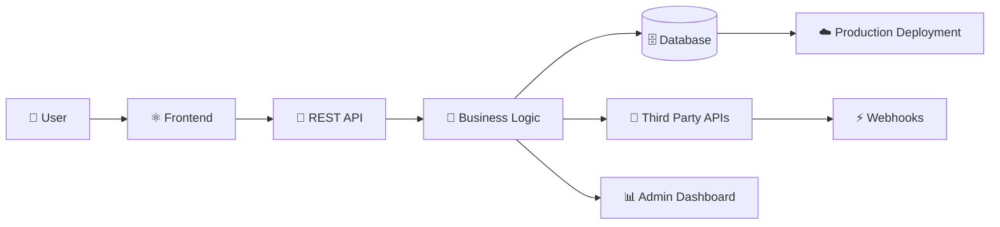

<div align="center">

<!-- ==================== HERO ==================== -->


<br/>


<br/><br/>

<p>
  <a href="https://www.linkedin.com/in/dheeraj-kumar-87382b222/">
    
  </a>
  <a href="mailto:dheerajk92114@gmail.com">
    
  </a>
  <a href="https://github.com/dheerajcoding">
    
  </a>
</p>

<br/>

```text
╭──────────────────────────────────────────────────────────────────────╮
│                                                                      │
│  SOFTWARE IS MORE THAN CODE.                                         │
│                                                                      │
│  It's how users, APIs, databases, integrations and business         │
│  workflows come together to solve a real problem.                    │
│                                                                      │
╰──────────────────────────────────────────────────────────────────────╯
```

</div>

---

# `$ whoami`

```typescript
const dheeraj = {
  name: "Dheeraj Kumar",

  role: "Full-Stack Developer",

  location: "India 🇮🇳",

  focus: [
    "Full-Stack Web Applications",
    "REST APIs",
    "Webhook Integrations",
    "Third-Party API Integrations",
    "CRM & LMS Systems",
    "Business Workflow Automation",
    "Production Deployment"
  ],

  currentlyLearning: [
    "JavaScript Fundamentals",
    "Data Structures & Algorithms",
    "Backend Architecture",
    "System Design",
    "Java & Spring Boot"
  ],

  mindset:
    "Understand the system. Solve the problem. Build it properly."
};
```

---

# 👨‍💻 About Me

I am a **Full-Stack Developer** interested in building real-world applications and understanding how complete software systems work.

My work and learning have involved:

```text
Frontend Interfaces
        ↓
REST APIs
        ↓
Backend Business Logic
        ↓
Databases
        ↓
Webhooks & Integrations
        ↓
Production Deployment
```

I enjoy working on systems where software directly supports a real workflow — such as:

* 📊 Lead Management Systems
* 🏢 Business Platforms
* 🎓 LMS & CRM Applications
* 🔗 API Integrations
* ⚡ Webhook-Based Workflows
* 🔐 Authentication & Role-Based Systems
* 🖥️ Admin Dashboards
* 🚀 Production Web Applications

My current goal is simple:

> **Move from knowing how to use technologies to deeply understanding how software systems are designed, debugged and built.**

---

# ⚡ ENGINEERING FOCUS

<div align="center">



</div>

I am particularly interested in the complete lifecycle of an application:

```text
IDEA
 │
 ▼
USER EXPERIENCE
 │
 ▼
FRONTEND
 │
 ▼
API DESIGN
 │
 ▼
BACKEND LOGIC
 │
 ▼
DATABASE
 │
 ▼
INTEGRATIONS
 │
 ▼
DEPLOYMENT
 │
 ▼
REAL USERS
```

---

# 🧰 TECHNOLOGY STACK

## Frontend

<p align="center">


</p>

<div align="center">

`React` • `Next.js` • `JavaScript` • `TypeScript` • `HTML` • `CSS` • `Tailwind CSS`

</div>

---

## Backend & APIs

<p align="center">


</p>

<div align="center">

`Node.js` • `Express.js` • `REST APIs` • `JWT` • `Authentication` • `Webhooks` • `API Integrations`

</div>

---

## Databases

<p align="center">


</p>

<div align="center">

`MongoDB` • `MySQL` • `PostgreSQL`

</div>

---

## DevOps & Development Environment

<p align="center">


</p>

<div align="center">

`Docker` • `Linux` • `Nginx` • `Git` • `GitHub` • `Postman` • `Production Deployment`

</div>

---

# 🏗️ WHAT I BUILD

<table>
<tr>

<td width="50%" valign="top">

## 🔌 APIs & Integrations

I work with systems that need to communicate.

```text
Application A
     │
     ▼
REST API
     │
     ▼
Validation
     │
     ▼
Business Logic
     │
     ├───────────────► External API
     │
     ▼
Database
     │
     ▼
Response
```

**Focus Areas**

* REST API development
* Webhooks
* API authentication
* Third-party integrations
* Request validation
* Data transformation
* Error handling

</td>

<td width="50%" valign="top">

## 🏢 Business Systems

I am interested in software that solves operational problems.

```text
USER
  │
  ▼
DASHBOARD
  │
  ▼
WORKFLOW
  │
  ▼
AUTOMATION
  │
  ▼
DATABASE
  │
  ▼
BUSINESS OUTCOME
```

**Examples**

* CRM Systems
* LMS Platforms
* Lead Management
* Admin Panels
* Role-Based Systems
* Workflow Automation

</td>

</tr>
</table>

---

# 🚀 SELECTED WORK

## 01 — Lead Management & Business Workflow System

### `SYSTEM_TYPE: CRM / LMS / LEAD MANAGEMENT`

A full-stack business-focused system built around managing leads, workflows and operational processes.

### Engineering Areas

```text
External Lead Source
        │
        ▼
   Webhook Endpoint
        │
        ▼
Authentication
        │
        ▼
Request Validation
        │
        ▼
Backend Processing
        │
        ▼
     Database
        │
        ▼
Business Workflow
        │
        ▼
 Admin Dashboard
```

### Areas I Have Worked With

* Lead ingestion workflows
* REST APIs
* Webhook integrations
* API authentication
* Data validation
* Backend processing
* Dashboard workflows
* Role-based access
* Production deployment
* System maintenance

<p>

🔗 **Live System:** https://olivialms.cloud

</p>

---

## 02 — Production Web Platforms

I have worked on production-oriented websites and business platforms across different use cases.

### Selected Live Projects

| Project                                           | Type                  | Focus                               |
| ------------------------------------------------- | --------------------- | ----------------------------------- |
| [RG Debt Relief](https://rgdebtrelief.com)        | Financial Services    | Web Platform & Business Workflows   |
| [Reddington Global](https://reddingtonglobal.com) | Corporate Platform    | Business & Corporate Web Experience |
| [RG Care](https://rgcare.in)                      | Organization Platform | Web Presence & Digital Workflows    |
| [Olivia LMS](https://olivialms.cloud)             | Business System       | Lead Management & CRM Workflows     |

> These projects represent real-world work I have been involved with. The exact responsibilities and implementation vary by project.

---

# 🧠 HOW I THINK ABOUT SOFTWARE

<div align="center">

```text
┌─────────────────────────────────────────────┐
│              USER PROBLEM                   │
└─────────────────────┬───────────────────────┘
                      │
                      ▼
┌─────────────────────────────────────────────┐
│          WHAT SHOULD THE SYSTEM DO?         │
└─────────────────────┬───────────────────────┘
                      │
                      ▼
┌─────────────────────────────────────────────┐
│        FRONTEND + BACKEND + DATA FLOW       │
└─────────────────────┬───────────────────────┘
                      │
                      ▼
┌─────────────────────────────────────────────┐
│        APIs + DATABASE + INTEGRATIONS       │
└─────────────────────┬───────────────────────┘
                      │
                      ▼
┌─────────────────────────────────────────────┐
│              TEST & DEBUG                   │
└─────────────────────┬───────────────────────┘
                      │
                      ▼
┌─────────────────────────────────────────────┐
│          DEPLOY & MAINTAIN                  │
└─────────────────────────────────────────────┘
```

</div>

---

# 📈 GITHUB ANALYTICS

<div align="center">


<br/><br/>


</div>

---

# 🎯 CURRENT ENGINEERING ROADMAP

```yaml
NOW:

  JavaScript:
    - Deep fundamentals
    - Async programming
    - Closures
    - Event loop
    - Memory and execution

  Problem Solving:
    - Data Structures
    - Algorithms
    - Coding patterns

  Backend:
    - API design
    - Authentication
    - Database design
    - Error handling
    - Architecture

NEXT:

  Java:
    - Core Java
    - OOP
    - Collections
    - Multithreading

  Spring Boot:
    - REST APIs
    - Spring Data
    - Spring Security
    - Backend architecture

LONG TERM:

  - System Design
  - Scalable Applications
  - Cloud Infrastructure
  - Distributed Systems
  - Strong Software Engineering Fundamentals
```

---

# ⚙️ CURRENT MISSION

```text
MISSION: BECOME A STRONG INDEPENDENT SOFTWARE ENGINEER

STATUS: ACTIVE 🟢

CURRENT PRIORITIES:

[██████████░░░░░░░░░░] JavaScript Fundamentals
[████████░░░░░░░░░░░░] Full-Stack Architecture
[██████░░░░░░░░░░░░░░] Data Structures & Algorithms
[█████░░░░░░░░░░░░░░░] Java & Spring Boot
[████░░░░░░░░░░░░░░░░] System Design

OBJECTIVE:
Understand systems deeply enough to design,
build, debug and improve them independently.
```

---

# 🤝 OPEN TO

```text
FULL-STACK DEVELOPMENT
        +
BACKEND ENGINEERING
        +
APIs & INTEGRATIONS
        +
BUSINESS APPLICATIONS
        +
SOFTWARE ENGINEERING OPPORTUNITIES
```

I am particularly interested in opportunities where I can work with experienced engineers, solve real problems and continue developing strong software engineering fundamentals.

---

# 📬 LET'S CONNECT

<div align="center">

<a href="https://www.linkedin.com/in/dheeraj-kumar-87382b222/">


</a>

<a href="mailto:dheerajk92114@gmail.com">


</a>

<a href="https://github.com/dheerajcoding">


</a>

<br/><br/>

```text
╔══════════════════════════════════════════════╗
║                                              ║
║   "Good software is not just about writing   ║
║    code. It's about understanding the        ║
║    system behind the problem."               ║
║                                              ║
╚══════════════════════════════════════════════╝
```

<br/>


</div>

---

<div align="center">

### ⚡ BUILDING. LEARNING. DEBUGGING. IMPROVING.

**Thanks for visiting my profile. Feel free to explore my repositories or connect with me.**

</div>
